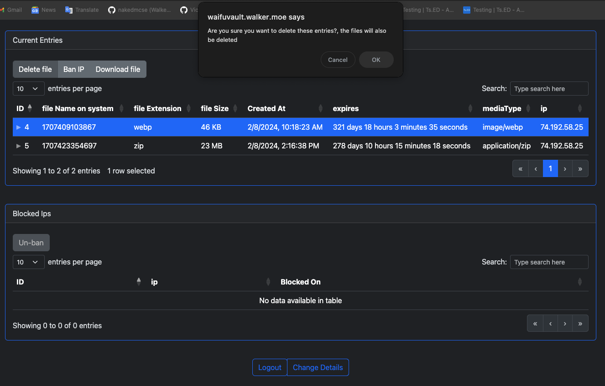
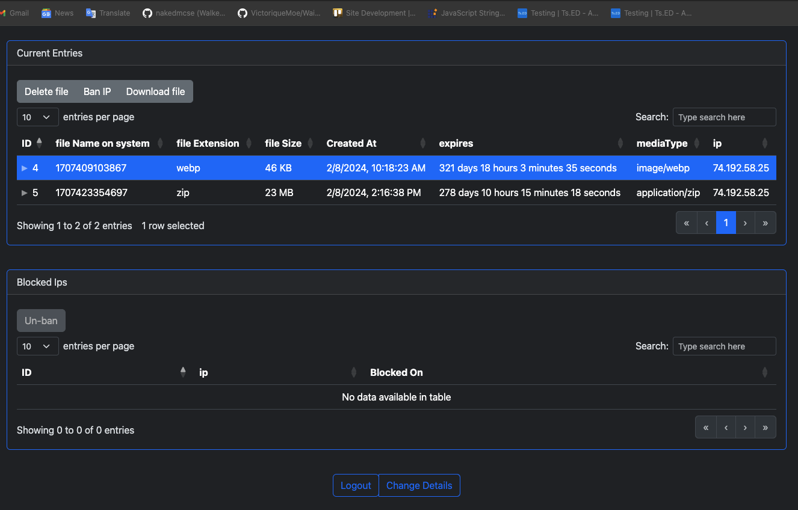
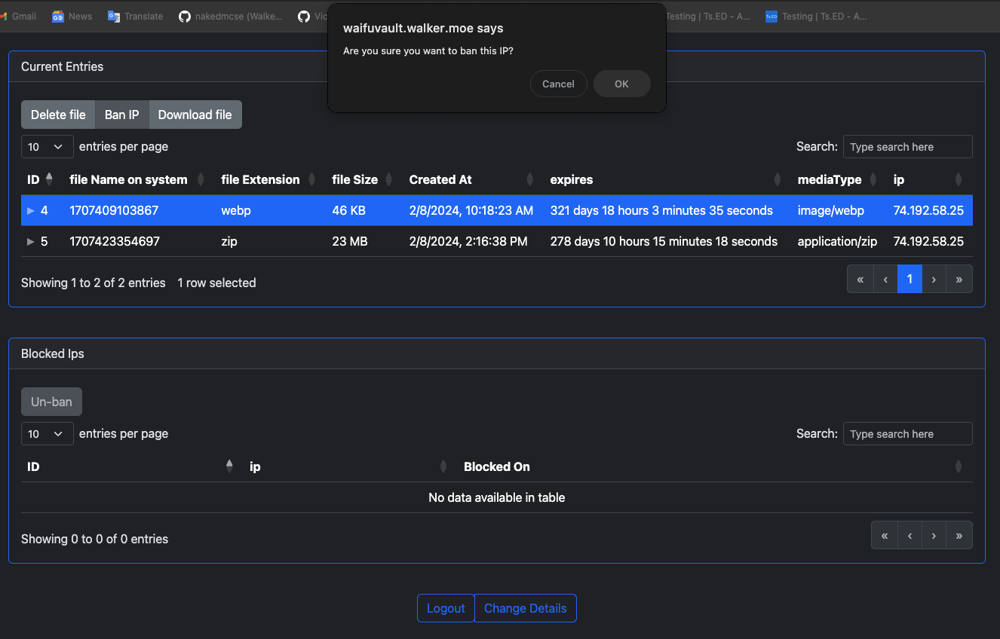
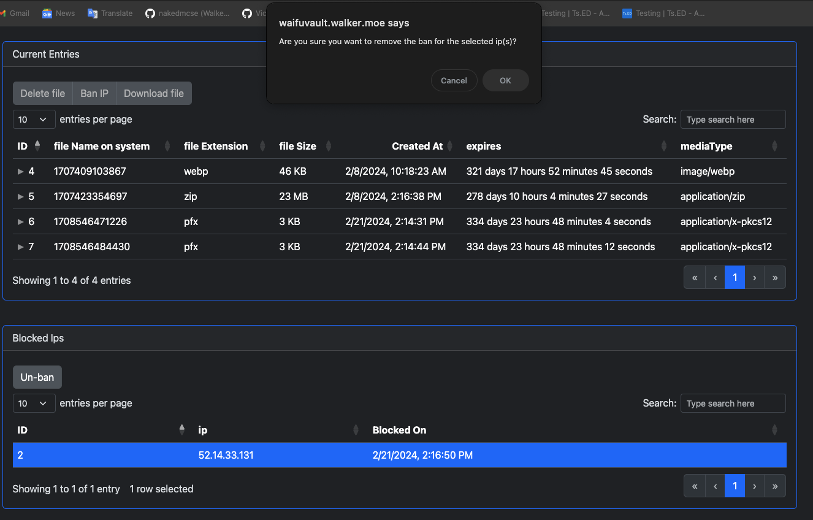
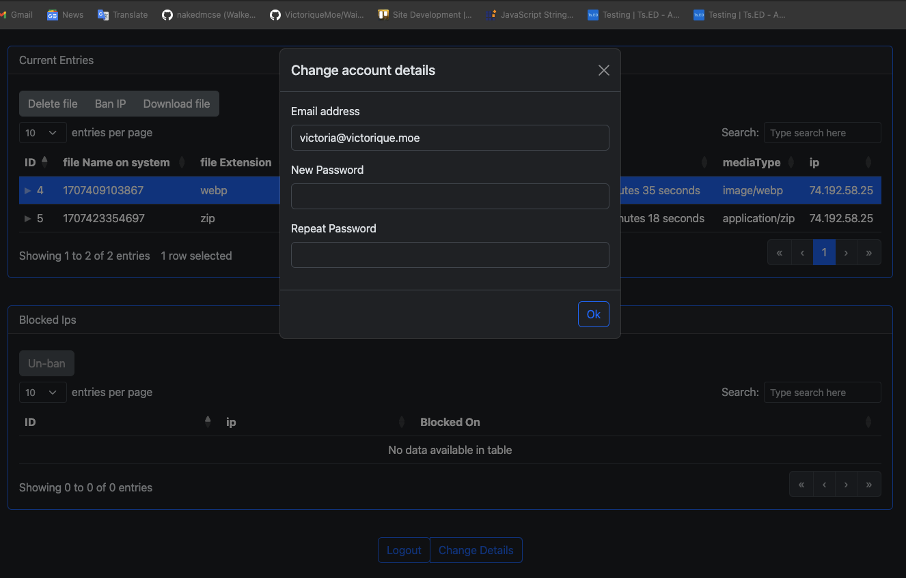

## WaifuVault

WaifuVault is a temporary file hosting service, that allows for file uploads that are hosted for a set amount of time.

The amount of time a given file is hosted for is determined by its size.  Files are hosted for a maximum of 365 days, 
with the time being shortened on a cubic curve.  This means for files up to about 50% of maximum file size will get 
close to the maximum time.  Beyond that, the time allotted drops off sharply, with the maximum size file getting 30 days of hosting.


## Getting started

> **Important!** this requires Node >= 14, Express >= 4 and TypeScript >= 4.

`.env` file must be created for this application to work. Rename `.envExample` to `.env`

### Env file settings
Required Settings

| Setting                   | Description                                                                   |
|---------------------------|-------------------------------------------------------------------------------|
| BLOCKED_MIME_TYPES        | Comma seperated list of MIME types that will be blocked from being uploaded   |
| FILE_SIZE_UPLOAD_LIMIT_MB | Limit on size of file allowed to be uploaded                                  |
| MAX_URL_LENGTH            | Maximum URL length that can be specified                                      |
| RECAPTCHA_SITE_KEY        | Replace this with your Google V2 Recaptcha Site Key                           |
| RECAPTCHA_SECRET_KEY      | Replace this with your Google V2 Recaptcha Secret Key                         |
| SALT                      | 8 Characters defining salt for encryption (if not set encryption is disabled) |
| SESSION_KEY               | Replace 'YourSessionKey' with a random string to use as the session key       |
> **Note Well** the file size sets the time to live for a file, so files close to the upload limit will only be hosted for 30 days.  It is a cubic curve so files up to 50% of the size will get close to a year of hosting time.

> **Google V2 Recaptcha** is required for the admin login page.  Use non invisible one.

> **SALT ISSUES - IMPORTANT - PLEASE READ** <br>If you have password protected files already before setting this, you
> will no longer be able to access them afterwards.<br>
> If you change the salt setting after password protected files have been added, you will no longer be able to access
> the files encrypted with the older salt.

Optional Settings

| Setting          | Description                                         |
|------------------|-----------------------------------------------------|
| CLAM_PATH        | The path to your Clam Antivirus installation        |
| MS_DEFENDER_PATH | The path to your MS Defender Antivirus installation |
> **Note Well** if a path to an Antivirus engine is not defined it will not be used, if no paths are defined then no antivirus scanning will be used

### Build and Run commands

```batch
# add directories (once after cloning)
    mkdir files

# install dependencies
    npm install
    
# build database
    npm run runmigration

# serve
    npm run start

# build for production
    npm run build
    npm run start:prod
```

## Admin Feature

This application comes with a useful admin panel that will allow you to control the files that are uploaded, and to 
provide security control with the ability to ban abusive IPs.


### Setup

On first startup you need to pay attention to the logs printed to screen - it will provide you with a username and 
password that can be used to log in to the admin.  This is random and only provided once.  The line looks like this:

```batch
New user created: email: "foo@example.com" password: "password" Please change this upon logging in!
```
> **Tip** For first startup run manually, so you can easily find the log file on screen

To get to the admin interface, go to **/login**, where you will provide the 
email and password from above.

Once you are logged in, you can click on the **Change Details** button, where you can change the email address
and password.

> **Note Well** It is recommended you change the default username and password at first startup.  The system will not 
> provide the default password again.

### Usage

Once in the admin, you can see what files have been uploaded and sort them by any of the available columns.
You can also ban and unban IP addresses from here, and download any files that have been uploaded.

### File Operations
Delete a file, by selecting it and pressing Delete File.  You will be asked if you are sure.



Download a file, by selecting it and pressing Download File.



### IP Operations
Ban an IP by selecting the file and pressing Ban IP, then confirming you want to ban it and if you want to delete
related files.



Unban an IP by selecting the IP in the lower table and pressing Un Ban, then confirming you want to unban.



### Account Operations

Click on Change Details to alter the login information for your account.



## REST Endpoints
All application functionality is provided by a set of REST endpoints.

| Endpoint             | Description                                                                              |
|----------------------|------------------------------------------------------------------------------------------|
| PUT /rest            | Upload file using either a provided file in form data or a provided URL hosting the file |
| GET /rest/{token}    | Return file information, including URL and time left to live                             |
| DELETE /rest/{token} | Delete file referred to by token                                                         |

## Site URL

> https://waifuvault.moe
